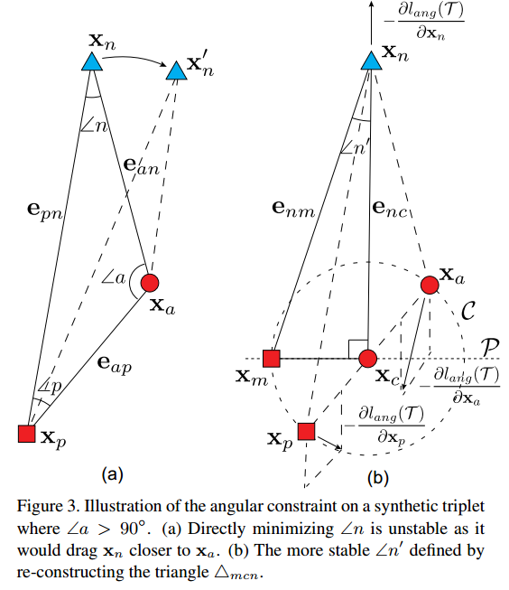
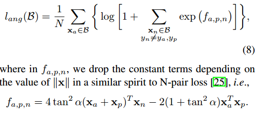

## Angular loss for deep metric learning

Tensorflow Implemenation of Deep Metric Learning with Angular Loss.
https://arxiv.org/abs/1708.01682




## NOTE:
+ All classes in an input batch should be different.
+ All embeddings should not be l2 normalized.
+ When you guys use this angular loss with [N-pair loss](https://www.tensorflow.org/api_docs/python/tf/contrib/losses/metric_learning/npairs_loss), let ```with_l2_reg``` be ```False```. If not, let it be ```True```.
+ I implemented only an angular mc loss. triplet version will be updated.

## Reference
```
@inproceedings{wang2017deep,
  title={Deep metric learning with angular loss},
  author={Wang, Jian and Zhou, Feng and Wen, Shilei and Liu, Xiao and Lin, Yuanqing},
  booktitle={2017 IEEE International Conference on Computer Vision (ICCV)},
  pages={2612--2620},
  year={2017},
  organization={IEEE}
}
```
